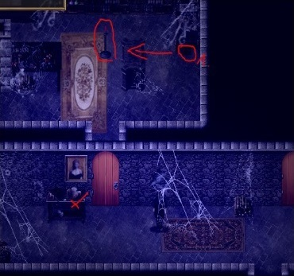

# 序章

> 本章为中文初译，待人工审核。原文版本：0.6.2.0。

!!! note "原图提示"
    原站第 10 步与第 12 步的配图画面看起来相同，第 10 步配图与森林小路的文字不符。这里沿用原站图片和顺序，未自行替换。

<!-- source:0001 -->
1. 从墙上拿起你的弓。

<!-- source:0002 -->
2. 过河，观看卫兵队长与一名士兵训练。你会学会防御打击（Defensive Strike）。

<!-- source:0003 -->
3. 走进旅店，与店主交谈，要点喝的。

<!-- source:0004 -->
**可选任务：凯特（Kate）请你寻找她的戒指。**

<!-- source:0005 -->

- 如果将戒指据为己有：堕落度 +1。
- 否则：凯特的好感度 +1。

<!-- source:0006 -->
4. 与马库斯（Marcus）和米拉（Mira）交谈，随后跟随马库斯进入小屋。你可以选择出面打断，或继续躲藏。

<!-- source:0007 -->
5. 离开后，戴夫（Dave）会出现并揍你。使用防御打击反击，米拉好感度 +1。

<!-- source:0008 -->
6. 向北进入森林，走到瞭望处。第一次遇到鹿时，由于你喝醉了，这次尝试必定失败。

<!-- source:0009 -->
7. 过桥回家，按你的喜好选择即可。

<!-- source:0010 -->
8. 先去你的小屋（旅店左侧），然后去艾米莉（Emily）的家（小屋北面），最后去村长家（过河后往东北方向走）。

<!-- source:0011 -->
9. 在旅店内与瑞克（Rick）交谈，随后再与旅店店主托马斯（Thomas）交谈。

<!-- source:0012 -->
10. 
    
    从村庄向北进入森林，找到隐秘小路。

<!-- source:0013 -->
11. 沿左侧通往山谷的小路前进。

<!-- source:0014 -->
12. 
    
    在小屋内拾取银币，并用火石（Fire stones）点燃蜡烛。

<!-- source:0015 -->
13. 从书架上拿取 4 本书，直到主角说已经拿够了，然后离开小屋。

<!-- source:0016 -->
14. 遇到女巫时，按你的喜好选择即可。如果选择与她性交，这会计入她的堕落度（参见格温 Gwen 章节）。
