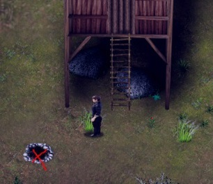

# 米拉

> 本章中文译文已通过人工审核。原文版本：0.6.2.0。

<!-- source:0001 -->
你的青梅竹马。她与母亲[艾米丽（Emily）](19-emily.md)和姐姐[弗莉莎（Frisha）](15-frisha.md)住在一起。

<!-- source:0002 -->
1. 进入艾米莉（Emily）的小屋并与她交谈。她会让你去找木材和能让她烹饪的东西。  
    要获得木材，需要找蒂娅（Tia）进行烹饪。  
    可以在瞭望处狩猎。  
    如果曾为佩妮（Penny）在田里干活，就给她蔬菜（胡萝卜/卷心菜）。

<!-- source:0003 -->
2. 与米拉（Mira）交谈（确保欲望值低于 80），问她正在读什么。

<!-- source:0004 -->
3. 去商店找卢修斯（Lucius）交谈。依次选择“我想问问” - “保持沉默”，将麻醉剂加入他的商店清单。再次选择“我想问问”，再选“告诉他” - “如果……会怎样？”，即可添加“控制欲望”任务。

<!-- source:0005 -->
4. 从架子上拿取羊皮纸（50 铜币）。

<!-- source:0006 -->
5. 
    
    前往森林中的瞭望处，拾取木炭。

<!-- source:0007 -->
6. 现在需要在晚餐后与米拉（Mira）交谈，但这只有在完成艾米莉（Emily）的任务后才可能。你可以狩猎兔子（会获得艾米莉的一点好感度），或在商店购买蔬菜。木材则去找蒂娅（Tia），购买木材或帮她劈木头。

<!-- source:0008 -->
7. 确保欲望值 <80（P）。与米拉（Mira）交谈，获得阅读 1 级；再做一次相同的事，获得阅读 2 级。

<!-- source:0009 -->
8. 好感度达到 7 时，阅读期间可以把手臂搭在她背上。

<!-- source:0010 -->
9. 在 8A 时重复把手搭在她背上的互动，并保持平静。

<!-- source:0011 -->
10. 在 9A 时重复该互动，解锁亲吻她。

<!-- source:0012 -->
11. 在 10A 时重复亲吻 2 次。艾米丽（Emily）会发现你们两人的关系，由此开始“探寻真相”任务。

<!-- source:0013 -->
12. 现在需要进入你的旧房子。可以付钱进入（村长家），或者如果已通过比安卡（Bianca）学会开锁，就在午夜后进入房子。

<!-- source:0014 -->
13. 打开马库斯（Marcus）房间的门（需要力量或开锁）。

<!-- source:0015 -->
14. 阅读桌上的信，然后搜索房间，寻找隐藏通道。

<!-- source:0016 -->
15. 房子里壁炉旁有一支火把（如果之前还没拿走）。

<!-- source:0017 -->
16. 进入密室，找到桌上的信。（之后这封信会出现在你的物品栏中，你可以随时再次阅读以获取额外信息。）

<!-- source:0018 -->
17. 前往艾米莉（Emily）的家；米拉（Mira）会开门并与你交谈。

<!-- source:0019 -->
18. 白天去教堂地下室拜访米拉（Mira）。现在需要去村长图书馆为她找一本书；前往宅邸，在图书馆房间左上方可以找到这本书。

<!-- source:0020 -->
19. 下午 4 点，米拉（Mira）会离开教堂。走进地窖，与她的工作台互动。

<!-- source:0021 -->
20. 第二天，在她于教堂工作时偷窥她（星号标记的位置）。

<!-- source:0022 -->
21. 次日重复此操作。

<!-- source:0023 -->
22. 晚上在家中与她交谈。这会触发为她建造烤炉的任务。

<!-- source:0024 -->
23. 去铁匠铺拜访约翰（John）。你必须已学会锻造（参见约翰（John）），他才会给你建造烤炉的配方。为此需要 5 根铜锭。获得铜的一种方法是从卢修斯（Lucius）的商店购买镐，在深林和遗迹附近开采铜矿脉；也可以击杀敌人，期望获得可在熔炉熔炼的生锈剑。

<!-- source:0025 -->
24. 在铁砧处建造烤炉。

<!-- source:0026 -->
25. 将烤炉安装在米拉（Mira）的房间中，并放入木材（任何时候都要保持其中有 3+ 木材。若缺少木材，最好的办法是带蒂娅（Tia）在队伍中跑遍森林。

<!-- source:0027 -->
26. 晚上在烤炉中有 3+ 木材时与米拉（Mira）交谈，并重复此操作，直到艾米莉（Emily）让你从窗户爬出去。

<!-- source:0028 -->
27. 第二天，等艾米莉（Emily）回到卧室（晚上 10 点），然后偷窥米拉（Mira）的门。应该会有走进去的选项；如果没有，先取消并确认艾米莉确实到达了她的终点位置，然后再试一次。

<!-- source:0029 -->
28. 次日晚上 10 点，可以用相同方式重复该场景并解锁额外姿势。若更换姿势 3+ 次，弗莉莎（Frisha）会观看。这会为你在艾米莉（Emily）房间与弗莉莎发生性关系的场景增加对话。

<!-- source:0030 -->
29. 现在可以再次与艾米莉（Emily）谈论米拉（Mira），但她会告诉你：只要米拉还是教堂的侍僧，就不要打扰她。

<!-- source:0031 -->
30. 至少与她发生过一次性关系后，现在可以在教堂内她的工作地点拜访她，触发新场景。

<!-- source:0032 -->
31. 从现在起，若你战斗失败，且已有 5 天未与米拉（Mira）发生性关系，她会用不同的方式叫醒你。

<!-- source:0033 -->
32. 米拉（Mira）加入教堂 14 天后，她的入会仪式会开始。仪式期间，如果之前没有完成她的恋爱任务，就无法继续推进；仪式后当然仍可继续。仪式后的对话会根据是否已完成该任务而变化。

<!-- source:0034 -->
33. 完成仪式（参见[教堂（Church）](07-church.md)）。

<!-- source:0035 -->
34. 在米拉（Mira）床上与她交谈，帮助她进行训练，直到她喜欢把塞子放进体内。这会触发口交场景。

<!-- source:0036 -->
35. 再做一次，也会与她发生性关系。

<!-- source:0037 -->
36. 艾米丽（Emily）上床后进入米拉（Mira）的房间，这会解锁与米拉的肛交场景。

<!-- source:0038 -->
37. 下午，如果已推进到她不介意圣徽塞进肛门的阶段，场景会增加另一段动画（0.4.4.2）；等米拉（Mira）达到高潮后更换姿势。如果已将艾米莉（Emily）的任务推进到她获得新裙子的阶段，她现在会发现你与米拉发生性关系并与你对质。（现在艾米莉已知情；若在米拉准备上床时拜访她，不必再等艾米莉回到房间。）

<!-- source:0039 -->
38. 根据此前行动，现在会重新获得在艾米莉（Emily）床边与她交谈的机会。若尚未与艾米莉开始关系，现在可以改变主意。无论如何，如果米拉（Mira）不知道主角与艾米莉的行动，主角之后必须告诉米拉。如果你在米拉面前与西法（Syfa）发生性关系，她会生气并开始与艾达琳（Aidalin）来往。除非你处于关闭 NTR 的模式……那就什么也不会发生，她会原谅你的一切。

<!-- source:0040 -->
39. 下次下午与米拉（Mira）发生性关系、且她达到高潮时，艾米丽（Emily）会再次出现并开始自慰。根据她的堕落度（需要 15+），你可以选择邀请她加入。

<!-- source:0041 -->
米拉（Mira）的故事会在[修道院](08-monastery.md)继续。

<!-- source:0042 -->
## 堕落：

<!-- source:0043 -->
如果替换过米拉（Mira）的塞子，那么无论是否这样做，现在只要在她口中射精都可以使她堕落。晚上在艾米莉（Emily）家中，现在可以要求她为你口交；由于此时她没有佩戴塞子，也可以在这里使她堕落。

> 原文版本标记：0.5.5.0 新增。

<!-- source:0044 -->
## 米拉（Mira）/艾米丽（Emily）/弗莉莎（Frisha）额外场景：

<!-- source:0045 -->
现在可以邀请米拉（Mira）/弗莉莎（Frisha）/艾米丽（Emily）到你的新房子洗澡。首先需要翻修房子并建造浴室。然后在艾米莉（Emily）家中与她们共进晚餐（3 人必须都在场）。主角现在会去房子里，她们会洗澡。如果此前已完成所有进度，米拉会让你单独与她洗澡，不要带其他人。晚餐后晚上拜访米拉，邀请她洗澡。之后必须避开艾米莉（Emily）。（如果被抓住，艾米莉与弗莉莎（Frisha）会在洗澡时出现；弗莉莎当天必须在家、没有和戴夫（Dave）在一起，并且仅限艾米莉知道米拉与主角发生性关系时。）如果建好了床，之后可以在房间里与米拉发生性关系；根据艾米莉是否看到她离开房子，她也会在你的房子留宿。

> 原文版本标记：0.5.3.0 新增。

<!-- source:0046 -->
## 艾达琳（Aidalin）路线：

<!-- source:0047 -->
- 如果在教堂任务中（圣所之后）选择了选项 3 或 4，米拉（Mira）现在会每天早上 7 点去艾达琳（Aidalin）的房间。无论是否观看，这都会发生。5 天后他们开始亲吻，10 天后会发生性关系。主角可以在教堂地窖与艾达琳（Aidalin）房间的门互动来观看。

<!-- source:0048 -->
- 在修道院期间，艾达琳（Aidalin）会在夜晚前往米拉（Mira）的房间与她发生性关系。主角可以从外面偷窥；如果他自慰，且已完成希瑟（Heather）的路线，她也会出现并带主角去她的房间。

<!-- source:0049 -->
## 其他：

<!-- source:0050 -->
- 夜晚米拉（Mira）准备上床时（22 时）可以偷窥她，只要确保不被艾米莉（Emily）抓到。

<!-- source:0051 -->
- 艾米丽（Emily）的任务开始后，如果与米拉（Mira）的好感度达到 10+A，可以再次亲吻她，或请求她协助筹集艾米莉的赎金。
