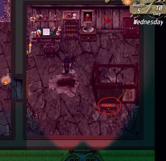

# Claire

> 本章为中文初译，待人工审核。原文版本：0.6.2.0。

<!-- source:0001 -->
旅店的厨师。 [凯特](11-kate.md)的母亲。

<!-- source:0002 -->
1. 白天在旅店与她交谈，这样晚上就能帮她的忙。

<!-- source:0003 -->
2. 下午 6 点至晚上 22 点，在厨房帮她削土豆或在地窖杀死老鼠。完成 20 次以上（事件可重复）可获得 +1 好感度。

<!-- source:0004 -->
3. 好感度达到 5 以上时，在她准备睡觉时与她交谈。

<!-- source:0005 -->
4. 若她的好感度达到 5 以上，在她睡觉的同一房间与凯特发生性关系会触发额外事件（会改变她谈及凯特时的对话）。

<!-- source:0006 -->
5. 
    
    晚上好感度达到 5A 时，她会让你去地窖拿一袋土豆和洋葱。沿厨房里的梯子下到酒窖，在那里找到2 袋东西（一袋藏在柜子附近的左侧墙边），并清理所有蜘蛛网（10 个）。

<!-- source:0007 -->
6. 可在地窖偷酒瓶来提高堕落度（可选）。

<!-- source:0008 -->
7. 在她准备睡觉时与她交谈，将她的好感度提高至 10 以上。

<!-- source:0009 -->
8. 若凯特不在房间里（若完成凯特第 7 步，需要给凯特酒），她愿意更进一步。也可把酒放在凯特床边的瓶子里，这会让凯特直接上床睡觉。

<!-- source:0010 -->
9. 与克莱尔发生过一次性关系后，可在夜里叫醒她以触发她原有的性爱场景。

> 原文版本标记：0.5.7.0 新增。

<!-- source:0011 -->
10. 削完土豆后再次与她交谈，她会和你一起下到地窖的标记地点。

<!-- source:0012 -->
11. 下一个事件也可在没有克莱尔的情况下触发：夜晚进入地窖，周二、周四或周日托马斯会下来（藏起来，别让他看见你）。若你和克莱尔在一起，场景会在他未发现你的情况下触发。

> 原文版本标记：0.5.7.0 新增。

<!-- source:0013 -->
12. 下一个场景后，便可搜查托马斯房间的小洞。要进入那里，必须先向比安卡学会开锁。

<!-- source:0014 -->
13. 等一天，然后晚上托马斯在酒馆楼下时，潜入他的房间，在墙洞里找到生锈的钥匙。（若未等一天，钥匙不会在洞里。）可选：可从床边的箱子偷钱，这会提高堕落度；箱中装着凯特在端菜小游戏中收集的全部钱。

<!-- source:0015 -->
14. 到铁匠铺拜访约翰，请他制作一把钥匙副本。

<!-- source:0016 -->
15. 
    
    将生锈的钥匙放回托马斯房间的洞里。

<!-- source:0017 -->
16. 打开地窖南侧的门。

<!-- source:0018 -->
17. 在周二、周四或周日的夜里（0:00 至 5:00）前往那里。

<!-- source:0019 -->
18. 完成第 9 步后，等到晚上 10 点，再到厨房与克莱尔交谈并工作（此前不要在那里工作）。

<!-- source:0020 -->
19. 在旅店自己的房间睡觉，连续 3 天不要与克莱尔发生性关系。

<!-- source:0021 -->
20. 早晨（上午 6 点至 8 点）她坐在火边时可以与她交谈；若已将她的好感度提高到 2，可与她同坐。若也将她的堕落度提高至 5，她会不止于交谈。

<!-- source:0022 -->
21. 看过托马斯前往地窖的锁门后，并且已与克莱尔发生 5 次性关系，会解锁厨房新内容。下午 6 点拜访她，然后为她工作。若带给她 30 个以上土豆，她会额外为你做些事。根据你与凯特的关系，克莱尔要么允许你锁门，要么让门开着让凯特进来。

<!-- source:0023 -->
22. 完成凯特的任务至前往老野猪旅店的阶段后，上午 9 点可在楼上走廊与她互动。若克莱尔的堕落度足够高（10 以上），她不会反对你尝试与她肛交。也可带她到主角的房间。在老野猪旅店与克莱尔解锁肛交后，她睡觉时，阿伦菲尔德的醉狐酒馆也会提供这些动画。

> 原文版本标记：0.5.8.0 新增。

<!-- source:0024 -->
23. 在你的房间里，克莱尔也会谈到她过去的婚礼（仅限此前在楼下与卡门谈过这件事）。

> 原文版本标记：0.5.8.0 新增。

<!-- source:0025 -->
24. 可选：与比约恩分享：
    
    1. 若比约恩在自己的房间里（他在楼下与卡门交谈时可与他互动），他会发现你在走廊与克莱尔发生性关系。
    2. 此后赌博时需输给比约恩最多 3 金币，他会提议归还这笔钱，以交换观看你在他的床上与克莱尔发生性关系。
    3. 完成后（比约恩必须在楼下，否则无法进入他的房间），可在赌博时再次与他交谈，他会向你索要更多。此时可接受或拒绝，也可要求补偿（完成凯特的任务步骤，或让他被自己的妻子戴绿帽；后者将来会扩展）。
    4. 若继续，在他于楼下与卡门交谈时，再次在他的房间发生性关系。场景结束后，第二天早晨与克莱尔交谈；此时可允许或不允许她随时与比约恩发生性关系。若允许，先在走廊与她互动但不要与她发生性关系，即可让她去他的房间；她因挫败会请比约恩帮她。
    5. 此事首次发生后，只要比约恩在房内，克莱尔每天早晨都会前往比约恩的房间。

> 原文版本标记：0.5.8.0 新增。

<!-- source:0026 -->
## 堕落路线：

<!-- source:0027 -->
23. 与她发生过一次性关系后，可选择让她为你口交，这会提高她的堕落度。

<!-- source:0028 -->
24. 满足以下条件时，可要求她在凯特面前发生性关系：她的堕落度达到 C5、你的阵营值达到 55 以上，且当晚早些时候已给凯特喝了安眠酒。

<!-- source:0029 -->
25. 若克莱尔达到 10C 以上，让她独处 3 天。随后在她于旅店外等待或与维蕾娜交谈时与她交谈，现在可选择私下与她交谈。若维蕾娜当时和你在一起，过一会儿她会来找克莱尔。
