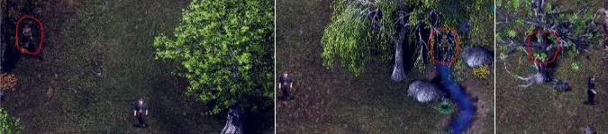
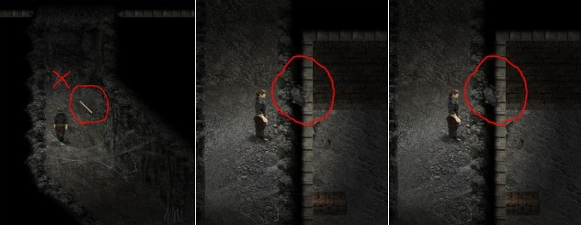

# 阿丽安娜

> 本章中文译文已通过人工审核。原文版本：0.6.2.0。

<!-- source:0001 -->
她与母亲[维蕾娜](17-verena.md)、父亲罗德里克和哥哥瑞克住在一起。

<!-- source:0002 -->
1. 完成序章后，在黑暗森林入口遇见她。

<!-- source:0003 -->
2. 也可以在遗迹遇见她。

<!-- source:0004 -->
3. 第一次在阿伦菲尔德城外遇见她的 7 天后，可以在同一地点再次见到她；她会请你去遗迹附近找她。

<!-- source:0005 -->
4. 去找她并和她玩 2 次捉迷藏（她会随机藏在遗迹附近，有些位置比其他位置更难发现）。如果找不到她，可以跳到第二天，她会重新选择藏身处。位置始终随机，其中一些藏身处很难看见（下图是部分示例）。
    
    

<!-- source:0006 -->
5. 第 3 次会发生剧情事件。

<!-- source:0007 -->
6. 必须已完成[科文](20-corven.md)的剧情，推进到野兔爪任务之后。

<!-- source:0008 -->
7. 下午 6pm 前，在遗迹附近的营地与科文交谈。

<!-- source:0009 -->
8. 询问他该如何对付狼人。随后前往铁匠铺。必须已完成学习锻造的部分。

<!-- source:0010 -->
9. 用熔炉把硬币熔成银锭。

<!-- source:0011 -->
10. 使用铁砧制作银箭。

<!-- source:0012 -->
11. 在科文的营地与他讨论接下来的行动。

<!-- source:0013 -->
12. 再次前往科文的营地找他，之后用 4 根原木修复旧礼拜堂附近的桥。

<!-- source:0014 -->
13. 进入礼拜堂，阅读右上方的书（必须已经学会阅读）。

<!-- source:0015 -->
14. 阅读书页后需要输入一个数字。答案是书签上红色印刷数字与左页数字之差。  
    1245 - 358 = 887

<!-- source:0016 -->
15. 在藏身处内尽量不要被守卫发现（可躲在木桶之间）。
    
    1. 如果卷入战斗并落败：你会被关进牢房。牢房上方的地面有个洞，可以从那里逃走。
    
    2. 可以在地道里找到一把镐。
    
    3. 用镐可以破坏标记位置的墙壁。
        
        
    
    4. 小心，地道里有蜘蛛；输给它们会导致游戏结束。生命值较低时，可在牢房里休息。
    
    5. 在监狱下方的房间里，可以找到一个装有他们从你身上偷走的全部物品的箱子。
    
    6. 在南边的地道里还能找到一把新弓。

<!-- source:0017 -->
16. 前往右下角牢房所在的位置，偷听那里的谈话。

<!-- source:0018 -->
17. 救出阿丽安娜（可以撬开门锁，也可以击败守卫取得钥匙）。

<!-- source:0019 -->
18. 带着阿丽安娜逃向出口。若走主走廊，会遇到狼人和几名守卫。现在正是杀死狼人的机会。使用银箭（物品），或在拥有银匕首时对狼人使用“血毒”技能，消除它的厚皮效果。（杀死它会使未来的一些场景无法触发。）如果不想与他们战斗，直接走蜘蛛地道即可（从外面也能用镐破坏墙壁）。

<!-- source:0020 -->
19. 如果阿丽安娜在队伍中，并且成功绕过狼人、偷听右上方圣所里的邪教徒，还会出现另一张图片。

<!-- source:0021 -->
20. 离开藏身处后会播放一段过场。阿丽安娜中了某种可怕液体的毒，它会让她变成野兽。

<!-- source:0022 -->
21. 要进行下一步，必须已完成[卢修斯](14-lucius.md)的任务，并在几天后再次拜访他的商店，买到强效麻醉剂。

<!-- source:0023 -->
22. 再次在遗迹附近与阿丽安娜交谈。
    
    1. 如果亲吻她，就会开启她的恋爱路线。
    2. 如果坚持让她喝下药剂，她会要求你在 7 天后回来，再给她一瓶（届时也可以改为选择与她发生性关系）。  
        若已启用 NTR，阿丽安娜在此期间还会寻找其他缓解方法，并前往科文的帐篷。下午 4pm 可以观看他们。

<!-- source:0024 -->
23. 与她发生性关系后，再和她玩一轮捉迷藏。这会解锁她的另一段动画。

<!-- source:0025 -->
24. （可选）如果已完成她此前的内容，与阿丽安娜玩捉迷藏时，她可能会卡在树干中（若已有 3 天未与她发生性关系，概率为 100%）。第一次把她救出来，下次再次发生时会触发新场景。（NTR：第二次时，可以选择把她留在树干里。）

<!-- source:0026 -->
25. 通过捉迷藏解锁两个场景后，离开阿丽安娜并等待 3 天，再与她交谈。她会告诉你自己被禁足了。（开启一项新任务。）

<!-- source:0027 -->
26. 潜入她父母的房子（木匠家），在不被发现的情况下进入楼上她的房间。（如果已经学会[开锁](26-bianca.md)，任何时间都可以进去。）

<!-- source:0028 -->
27. 晚上 10pm 与她交谈；场景结束后下楼，进入工坊，再进入楼上罗德里克的书房，搜索柜子和所有书架，直到主角看够为止。

<!-- source:0029 -->
28. 查看当天是星期几（例如星期一）。等到第二天（星期二），再次搜索罗德里克书房里的柜子。

<!-- source:0030 -->
29. 在星期二、星期四或星期日的午夜等在楼下。不要快进时间，观察罗德里克去了哪里。

<!-- source:0031 -->
30. 检查柜子，需要通过一次感知检定。完成后即可向下爬。最好为接下来的事情备齐装备并使用存档选项，因为一旦失败，就无法活着出来。

<!-- source:0032 -->
31. 罗德里克位于藏身处时与他对峙。为了赢得战斗，需要用银制武器（银匕首或银箭）消除他的免疫增益。

<!-- source:0033 -->
32. 第二天晚上与阿丽安娜交谈。此后她每两天会离开房子一次。她的禁足现已部分解除，任务也已完成。

<!-- source:0034 -->
33. 在书房与罗德里克讨论邪教。如果克莱尔的剧情尚未开启这项内容，此时会开始一项潜入邪教的任务。

> 原文版本标记：0.6.1.0 新增。

<!-- source:0035 -->
34. 现在必须查明主角家地下室里马库斯旧长袍的情况，以及旅店下方的邪教集会。若要了解托马斯参与其中的情况，必须完成克莱尔的任务。

<!-- source:0036 -->
35. 下一步是修补马库斯的旧长袍。从地窖拿出长袍，在工作台上缝补（需要足够高的缝纫技能）。

<!-- source:0037 -->
36. 带着长袍返回罗德里克处，他会给你一副潜入时需要使用的面具。

<!-- source:0038 -->
37. 进入旧教堂下方的藏身处（此前救出阿丽安娜的地方），与身穿绿色长袍的邪教徒交谈，出发寻找失踪的兄弟。

<!-- source:0039 -->
38. 接下来需要潜入餐厅取一些葡萄酒，检查那张摆有王座的独立桌子。

<!-- source:0040 -->
39. 晚上你会溜出藏身处并返回阿伦菲尔德，在那里发现阿丽安娜失踪了。检查她的房间，然后等到第二天早上。只有白天才能在房子外找到她留下的踪迹。

<!-- source:0041 -->
40. 检查森林中她藏身处附近的区域，会发现通往地图北方（暗林遗迹）的脚印。

<!-- source:0042 -->
41. 前往顶部中央的房子找到阿丽安娜，再沿来路带她离开。

<!-- source:0043 -->
42. 为避免对推进顺序产生困惑，我把下一部分拆分为本攻略的独立“重建暗林”章节，见[这里](48-darkholt.md)。

<!-- source:0044 -->
43. 现在会解锁森林中与阿丽安娜的新动画。也可以在森林里与拥有新身体的她进行肛交；这样做还会解锁在她房间里的肛交训练。

<!-- source:0045 -->
44. 在家中与阿丽安娜进行肛交后，会解锁与科文共享她的场景（见下文）。如果维蕾娜穿着新衣服并观看阿丽安娜，还会解锁维蕾娜的场景。肛交场景中，阿丽安娜会注意到维蕾娜。（若走罗德里克路线，该场景中罗德里克会与维蕾娜发生性关系。）

<!-- source:0046 -->
45. 解锁阿丽安娜与维蕾娜场景的方法：重复在阿丽安娜房间里与她进行肛交，让她注意到母亲；主角会提到让维蕾娜的门开着。当维蕾娜在房间里时，进去并让门保持敞开，这样阿丽安娜就能过来观看。

<!-- source:0047 -->
46. 以这种方式与维蕾娜发生性关系后离开，就能观看阿丽安娜在自己房间里自慰。

<!-- source:0048 -->
47. 在阿丽安娜的房间里与她发生性关系，并谈论维蕾娜。

<!-- source:0049 -->
48. 再次在房门敞开时与维蕾娜发生性关系，便会出现邀请阿丽安娜加入的选项。

<!-- source:0050 -->
49. 阿丽安娜拜访鲁玛：她的禁足解除后，从北侧出口离开阿伦菲尔德（必须是在阿丽安娜身处森林的那一天）。尝试向桥梁方向离开时，她会出现。

> 原文版本标记：0.5.3.0 新增。

<!-- source:0051 -->
50. 前往鲁玛，会得知侦察兵发现了阿丽安娜；根据所走路线，这会触发她与主角或达桑的互动。现在可以让阿丽安娜离开（她将永远不再返回鲁玛），也可以让她成为你的伴侣。

<!-- source:0052 -->
51. 此后每当她拜访鲁玛时，都会开放与她的互动。  
    NTR：若走达桑路线，他会设法与她上床。让他们在鲁玛独处几天，然后在中午前拜访鲁玛，就能当场撞见他们。

<!-- source:0053 -->
52. 共享：即使正处于阿丽安娜的恋爱路线，也可以与科文开启相关情节。阿丽安娜拜访鲁玛期间，如果她看到妮拉被两个男人性交，与她交谈，她会提起关于共享的对话，你可以允许或禁止共享。

<!-- source:0054 -->
53. 共享：如果曾在阿丽安娜的房间里与她进行肛交，现在便可以加入她与科文的场景。

