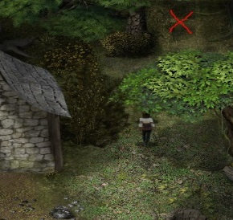
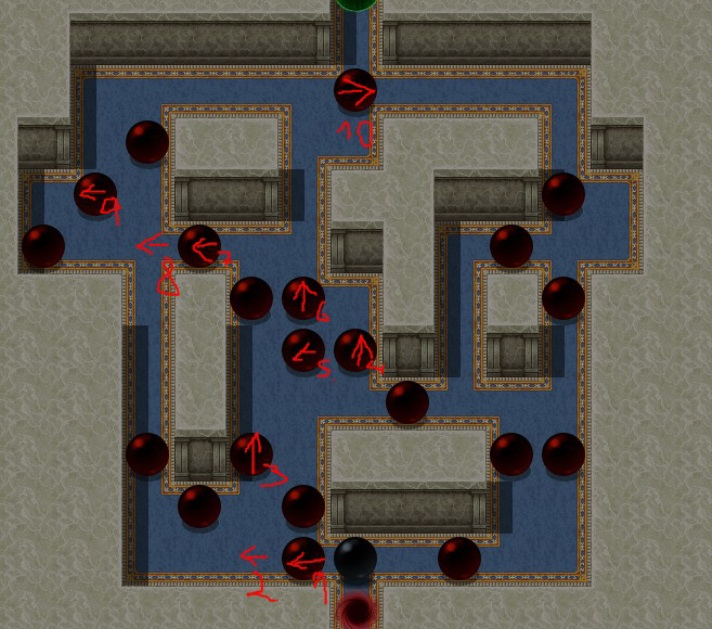
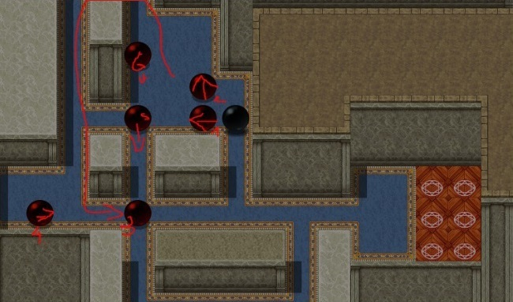

# 格温

> 本章为中文初译，待人工审核。原文版本：0.6.2.0。

<!-- source:0001 -->
小屋中的女巫，[萨布丽娜](37-sabrina.md)的主人。

<!-- source:0002 -->
1. 完成序章后，在小屋内与她交谈并和她发生性关系（4 次），直到她的堕落度达到 20（可在关系菜单查看当前堕落度）。之后她每天都会失去堕落度；若降至 0，她会变回原本形态。要推进任务，必须始终帮助她保持新形态。

<!-- source:0003 -->
2. 现在必须学会阅读（见[米拉](06-mira.md)）。

<!-- source:0004 -->
3. 再次与她交谈，并请求成为她的学徒，这会开启“亵渎狩猎”任务。

<!-- source:0005 -->
4. 
    
    进入沼泽并绕行，直到主角说必须在洞穴内搜索。

<!-- source:0006 -->
5. 现在必须与疫病恶魔战斗并取胜（15 级以上）；若遇到困难可带上蒂娅。

<!-- source:0007 -->
6. 回到小屋后会与格温交谈。若幸运且疫病恶魔掉落心脏，任务就完成；否则等待 3 天后再次进入沼泽，新疫病恶魔每 3 天会生成一次。杀死它们直到获得心脏，再在格温处于新形态时，于坩埚旁与她交谈。

<!-- source:0008 -->
7. 现在等待 4 天，直到萨布丽娜恢复。通过门进入房间以触发场景。

<!-- source:0009 -->
8. 现在可进入格温的卧室，在她睡觉时与她发生性关系（掀开被子）。

<!-- source:0010 -->
9. 与萨布丽娜交谈以开始训练。每天只能进行一次，会进入 3 个需要完成的谜题；若卡住，只需离开房间，或使用物品栏中的书（关键物品）：
    
    1. 
    2. 
    3. 
        
        要开始第 3 个谜题，必须先将巫术技能提高到 2（天赋点）。

<!-- source:0011 -->
10. 完成谜题后，在格温位于坩埚旁时与她交谈（同样必须处于年轻形态），谈论与她结盟。

<!-- source:0012 -->
11. 下一步必须作出决定：成为格温的勇士，或违抗她；后者会进入她妹妹阿西娅的替代路线。（若拒绝格温，仍可与她发生性关系，但不会变强，她仍会把你当作宠物对待。）若选择违抗，以下步骤全部跳过。但仍可通过夜晚在床边与她交谈（变换姿势）及白天在坩埚旁交谈，观看新场景。

<!-- source:0013 -->
12. 若与她结盟，她会要求带来仪式材料。可从阿伦菲尔德东侧农田地图的干草堆取得稻草；木材须在森林收集，布料可在商店购买。

<!-- source:0014 -->
13. 之后回去找格温；她会在房间中与你私下交谈。随后你将见证仪式。

<!-- source:0015 -->
14. 回去找格温，再次谈论结盟。她现在会与你缔结契约。从此使用她的任何魔法都会提高她的堕落度，你也会学会一个新法术。格温堕落度达到 100 时，会获得进一步提高魔法伤害／防御并使你免疫中毒／流血的增益。若她的堕落度低于 5，她会吸取你的能量来恢复一些堕落度。
