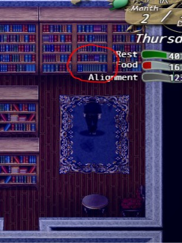

# 市长宅邸

> 本章中文译文已通过人工审核。原文版本：0.6.2.0。

<!-- source:0001 -->
1. 要进入，需用一瓶酒贿赂阿伦菲尔德桥边的守卫。

<!-- source:0002 -->
2. 
    
    沿河流从府邸下方流过的路径向上走，找到秘密入口。到达后需要火把才能继续；火把可在主角的房子里找到。（可拜访市长并支付 20 金币，或若已开始比安卡的任务，可在午夜后用开锁打开门。）

<!-- source:0003 -->
3. 火把在主角房子窗边的木桶上。

<!-- source:0004 -->
4. 到达市长府邸下方后，需通过力量或开锁打开门（不用管右边的门，即便现在开锁，它也不会打开）。

<!-- source:0005 -->
5. 进入府邸前：避免被守卫或房内的人发现。若完成艾米莉的任务，可选择穿上仍持有的强盗伪装；被抓时这可避免承担后果，但会使府邸进入警戒。被抓后需过一天才能恢复正常。若未伪装而被抓，你在阿伦菲尔德的声望会下降。

<!-- source:0006 -->
6. 
    
    走进市长的图书馆或办公室，在书架处寻找秘密门。至少需要 1 点感知才能发现它（天赋）。会收到注意到新鲜空气的提示，然后检查书架进行天赋检定。若靠近书架却没有出现提示，需再次点击书架以获得另一机会。

<!-- source:0007 -->
7. 找到后前往地下室。在房间东南角的桶里可找到门的钥匙。现在移开门前的袋子，开启这条捷径。床上还有一封可阅读的信，会将一张雅斯敏的图片加入背包（可在关键物品中再次打开）。

<!-- source:0008 -->
8. 前往吉隆的办公室；现在在书架内也可使用“停留”选项。身处其中时按回车键或点击书架即可互动。

<!-- source:0009 -->
9. 在吉隆的办公室阅读其桌上的信，获得关于基尔利克男爵的情报。

<!-- source:0010 -->
10. 现在已解锁进行弗莉莎和雅斯敏剧情所需的一切。

<!-- source:0011 -->
11. 莉维娅带领士兵进入森林后，可在夜里开锁正门，以更快进入府邸。

> 原文版本标记：0.5.1.0 新增。

<!-- source:0012 -->
## NTR 路线：

<!-- source:0013 -->
可将仆人睡房中的酒瓶替换为精液酒（用酒瓶和精液小瓶制作）。午夜时朱莉娅会获得 +1C；这样做 5 次后，她会在睡前与约瑟夫发生性关系（仅在雅斯敏的对话中拒绝她的爱情选项时）。
